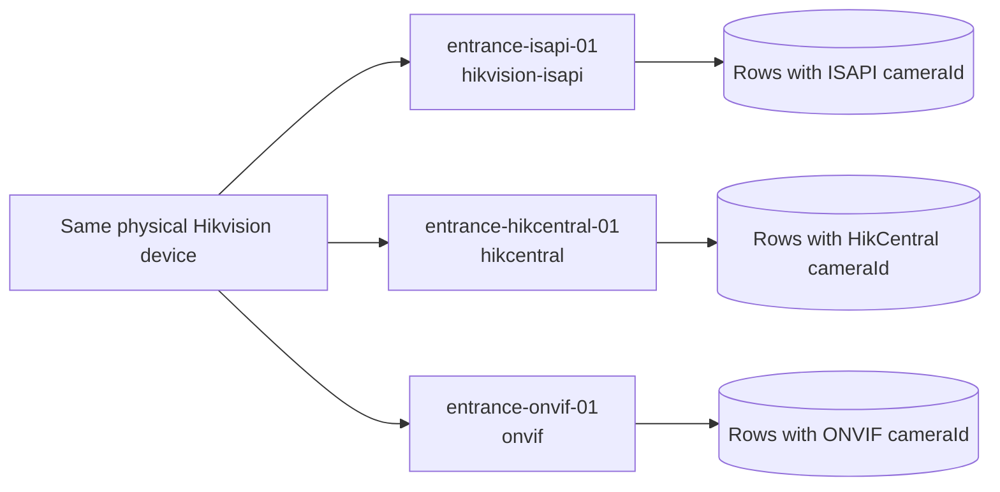
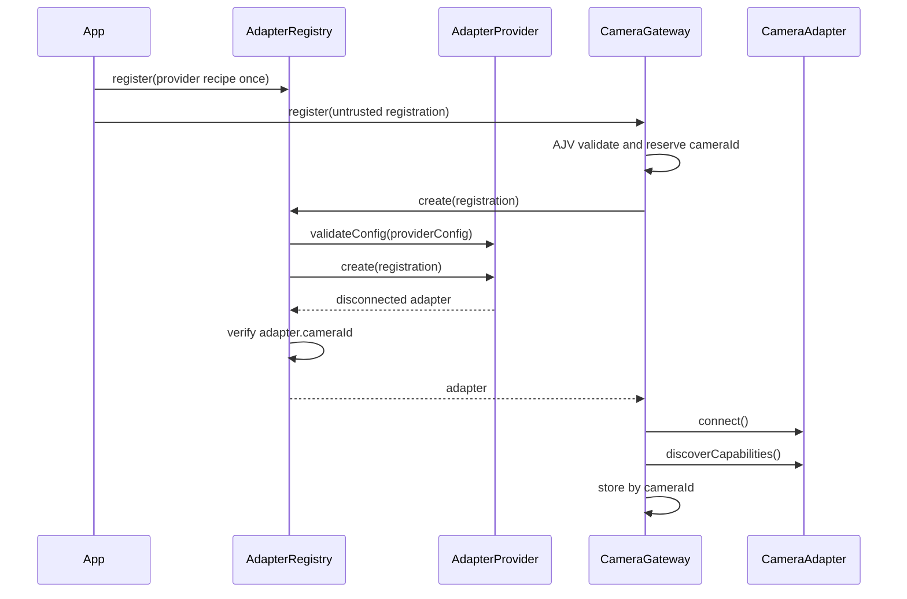

# Architecture

## Identity model

The architecture treats every registration as an independent logical camera. No internal field groups registrations by physical device.

The physical device relationship is deployment knowledge, not gateway identity. There is no arbitration, shadow mode, or automatic deduplication.

## Current implemented architecture

```mermaid
flowchart LR
    File[Local inventory JSON file]
    Loader[Bounded inventory file loader]
    Schema[AJV registration schema]
    Inventory[Inventory validation and duplicate check]
    Startup[Independent startup coordinator]
    Discovery[Trusted-folder plugin discovery]
    Registry[AdapterRegistry]
    Provider[AdapterProvider recipe]
    Adapter[CameraAdapter instance]
    Gateway[CameraGateway]
    Output[PostgresPeopleFlowOutputPort]
    Timescale[(TimescaleDB hypertable)]
    Query[Camera-scoped query repository]
    API[Fastify API]
    Dashboard[Dashboard selector]

    File --> Loader --> Inventory
    Inventory --> Schema
    Inventory --> Startup --> Gateway
    Discovery --> Registry
    Gateway --> Registry --> Provider --> Adapter
    Gateway -->|connect, discover, health, unregister, shutdown| Adapter
    Adapter -->|canonical people.flow| Output --> Timescale
    Timescale --> Query --> API --> Dashboard
```

Implemented modules:

| Module | Responsibility | Status |
| --- | --- | --- |
| `src/contracts/camera-registration.ts` | Trusted registration shape | Complete |
| `src/contracts/camera-registration-schema.ts` | Runtime registration JSON rules | Complete |
| `src/contracts/camera-registration-validator.ts` | `unknown` to `CameraRegistration` boundary | Complete |
| `src/contracts/camera-inventory-validator.ts` | Array, size, per-entry, and duplicate-ID validation | Complete |
| `src/config/camera-inventory-file-loader.ts` | Bounded local file read, safe file errors, JSON parsing, and inventory validation | Step 1G.2 complete |
| `test/camera-inventory-file-loader.test.ts` | Valid/empty inventory and safe file-boundary failure proof | Step 1G.3 complete; 6 tests verified |
| `src/startup/camera-startup-report.ts` | Safe per-camera startup result and aggregate readiness contract | Step 1G.4 complete |
| `src/startup/register-camera-inventory.ts` | Sequential independent registration coordinator | Step 1G.5 complete |
| `test/register-camera-inventory.test.ts` | Ready/degraded, isolation, cleanup, and empty-startup proof | Step 1G.6 complete; 3 tests verified |
| `src/startup/start-camera-gateway-from-file.ts` | File-to-gateway startup composition | Step 1G.7 complete |
| `test/start-camera-gateway-from-file.test.ts` | Complete valid, degraded, invalid-inventory, and invalid-JSON startup proof | Step 1G.8 complete; 4 tests verified |
| `src/providers/hikvision-isapi/hikvision-isapi-config.ts` | Trusted non-secret ISAPI provider settings and adapter-type constant | Step 2A.1 complete |
| `src/providers/hikvision-isapi/hikvision-isapi-config-schema.ts` | Closed and bounded runtime ISAPI configuration shape | Step 2A.2 complete |
| `src/providers/hikvision-isapi/hikvision-isapi-config-validator.ts` | AJV structural and URL-origin semantic validation | Step 2A.3 complete |
| `test/hikvision-isapi-config-validator.test.ts` | Safe origin, credential exclusion, channel, timeout, and closed-schema proof | Step 2A.4 complete; 10 tests verified |
| `src/providers/hikvision-isapi/hikvision-isapi-credentials.ts` | Provider-specific private credential and resolver contracts | Step 2B complete |
| `src/providers/hikvision-isapi/environment-hikvision-isapi-credential-resolver.ts` | Explicit environment-variable bindings and secret-safe resolution | Step 2B complete |
| `src/providers/hikvision-isapi/hikvision-isapi-http-client.ts` | Origin-confined, timeout/size-bounded Digest XML transport | Steps 2C/2I complete |
| `src/providers/hikvision-isapi/hikvision-isapi-device-info-client.ts` | Read-only device-information request and safe parser | Step 2D complete |
| `src/providers/hikvision-isapi/hikvision-isapi-counting-report-client.ts` | Previous completed UTC-hour counting request | Step 2E complete |
| `src/providers/hikvision-isapi/hikvision-isapi-counting-report-parser.ts` | Native XML to provider-neutral hourly observations | Steps 2F/2I complete |
| `src/providers/hikvision-isapi/hikvision-isapi-people-flow-collector.ts` | Parser, normalizer, and output-port orchestration | Step 2G complete |
| `src/providers/hikvision-isapi/hikvision-isapi-adapter.ts` | Device proof, initial collection, fixed polling, health, and cleanup | Step 2H complete |
| `src/providers/hikvision-isapi/hikvision-isapi-provider.ts` | Registration/config/credentials to one disconnected runtime adapter | Step 2H complete |
| `src/providers/hikvision-isapi/hikvision-isapi-smoke-check.ts` | Local read-only end-to-end smoke path with safe result reporting | Step 2J implemented; live success pending |
| `src/providers/adapter-provider-plugin.ts` | Trusted brand-plugin entry-point contract | Step 3H complete |
| `src/providers/discover-adapter-providers.ts` | Deterministic source/compiled plugin discovery and validation | Step 3H complete |
| `src/providers/hikvision-isapi/plugin.ts` | ISAPI plugin assembly boundary | Step 3H complete |
| `src/startup/create-adapter-registry-from-plugins.ts` | Registry composition from discovered provider recipes | Step 3H complete |
| `src/providers/plugin-discovery-smoke-check.ts` | Compiled discovery proof without camera connections | Step 3H complete |
| `src/adapters/camera-adapter.ts` | Shared adapter lifecycle interface | Complete |
| `src/adapters/adapter-provider.ts` | Provider recipe interface | Complete |
| `src/adapters/adapter-registry.ts` | Provider registration/selection and identity guard | Complete |
| `src/core/camera-gateway.ts` | Registration, rollback, health, removal, and shutdown | Complete for current scope |
| `src/observations/periodic-people-flow-observation.ts` | Provider-neutral hourly observation interfaces | Step 1F.1 complete; compile-only contract |
| `src/contracts/people-flow-measurement.ts` | Canonical periodic people-flow output interface | Step 1F.2 complete; compile-only contract |
| `src/contracts/people-flow-measurement-schema.ts` | Closed runtime JSON schema for canonical periodic measurements | Step 1F.3 complete; connected to the AJV parser in Step 1F.4 |
| `src/contracts/people-flow-measurement-validator.ts` | AJV `unknown`-to-canonical parser with strict date-time format | Step 1F.4 complete and focused tests verified in Step 1F.5 |
| `src/core/periodic-people-flow-normalizer.ts` | Observation-to-canonical mapper with camera-scoped SHA-256 IDs | Step 1F.6 complete |
| `test/periodic-people-flow-normalizer.test.ts` | Mapping, retry identity, logical-camera isolation, and rejection proof | Step 1F.7 complete; 6 tests verified |
| `src/output/people-flow-output-port.ts` | Replaceable asynchronous canonical publication boundary | Step 1F.8 complete; compile-only interface |
| `src/output/in-memory-people-flow-output-port.ts` | Retry-safe in-memory publication proof with per-camera reads | Step 1F.9 complete |
| `test/in-memory-people-flow-output-port.test.ts` | Camera isolation, replacement, and defensive-copy proof | Step 1F.10 complete; 5 tests verified |
| `src/database/` | Bounded configuration, credential boundary, pool, TimescaleDB migration, and migration runner | Step 3A/3B complete |
| `src/output/postgres-people-flow-output-port.ts` | Parameterized canonical upsert keyed by measurement ID and observed time | Step 3C complete |
| `src/query/` | Required-camera query validation and PostgreSQL latest/history repository | Step 3D complete |
| `src/analytics/people-flow-analytics-service.ts` | One-camera overview totals with identity guard | Step 3D complete |
| `src/api/create-api-server.ts` | Safe camera list, selected-camera health, latest, history, and overview routes | Step 3E complete |
| `src/dashboard/` | Local dashboard and selector; every widget request carries one logical camera ID | Step 3F complete |
| `src/application.ts` | Local composition root for migration, provider startup, storage, query, API, dashboard, and cleanup | Step 3G complete |

Test doubles live under `test/support/` and are not production providers. They provide deterministic clocks, lifecycle counters, controlled failures, and connect/disconnect gates.

## Inventory startup

The complete inventory file is bounded, parsed, and structurally validated before any adapter is created. Once trusted, registrations are attempted sequentially in inventory order. Individual provider failures become safe per-camera `failed` results and do not remove earlier successes or prevent later registrations. Invalid file-level input rejects startup before network work begins.

## Provider lifecycle

Network activity belongs in `connect()`, not provider construction. One provider may create many adapters, but each adapter represents exactly one logical camera.

## Registration failure and cleanup

The gateway reserves pending IDs before its first asynchronous operation, preventing concurrent duplicates. Any adapter creation, connection, or discovery failure triggers best-effort disconnect. Failed registrations are never placed in the registered camera map.

Unregister removes a camera only after `disconnect()` succeeds. Shutdown attempts every registered logical camera independently; successfully cleaned cameras are removed and failed IDs remain known for retry. The application composition root must eventually stop new registrations before shutdown begins.

## People-flow implemented architecture

```mermaid
flowchart LR
    Native[Native XML/JSON/event]
    Client[Provider client]
    Parser[Provider parser]
    Observation[PeriodicPeopleFlowObservation]
    Normalizer[People-flow normalizer]
    Contract[Canonical schema validation]
    Output[Output port]
    Storage[(people_flow with camera_id)]
    Analytics[Per-camera analytics]
    API[Camera-filtered API]
    UI[Dashboard camera selector]

    Native --> Client --> Parser --> Observation
    Observation --> Normalizer
    LogicalId[Registered logical cameraId] --> Normalizer
    Normalizer --> Contract --> Output --> Storage --> Analytics --> API --> UI
```

The complete local path exists: ISAPI observations are normalized and validated, published through the PostgreSQL output adapter, stored in the TimescaleDB hypertable, queried only with a logical `cameraId`, exposed through Fastify, and displayed through a selected-camera dashboard. The in-memory output remains a deterministic test adapter.

The parser understands vendor-native data. The normalizer attaches the registration's logical `cameraId` and produces a canonical measurement. Source metadata remains diagnostic and does not affect camera grouping.

## Provider boundaries

The ISAPI configuration boundary accepts only an HTTP(S) origin, a safe provider-native channel ID, and a bounded request timeout. It rejects embedded URL credentials, endpoint paths, query strings, fragments, surrounding whitespace, and unknown fields. Raw credentials remain outside this contract and are resolved from `CameraRegistration.credentialRef` through explicit environment-variable bindings.

The direct ISAPI flow is `registration -> provider config/credential resolution -> Digest XML client -> device/report clients -> native parser -> periodic observation -> camera-scoped normalizer -> output port`. Provider construction performs no network request. `adapter.connect()` performs a read-only device-information request and initial previous-hour collection, then starts a code-owned five-minute polling loop. A later poll failure marks the adapter degraded; disconnect aborts and waits for the loop.

Deterministic tests prove this software behaviour. The attempted live smoke check timed out while the camera was down, so actual Digest authentication, device XML, report endpoint, UTC request acceptance, and report XML compatibility remain unverified.

Each provider should own:

- non-secret configuration schema;
- credential-reference resolution at the composition boundary;
- transport/authentication client;
- native parser;
- adapter implementation;
- provider recipe;
- focused unit and integration tests.

Shared core should own:

- registration and canonical contract validation;
- provider registry;
- gateway lifecycle;
- normalizer interfaces and output ports;
- persistence/query abstractions;
- API models that use logical `cameraId`.

## Automatic brand-plugin discovery — complete for current scope

The shared plugin contract and deterministic trusted-folder discovery loader are implemented and verified. Each immediate `src/providers/<plugin-id>/` folder can expose one `plugin.ts` entry point during TypeScript development and one compiled `plugin.js` entry point after build. Discovery scans folders in deterministic order, validates the exported plugin contract, calls it to create disconnected `AdapterProvider` recipes, and returns those recipes for `AdapterRegistry`.

The plugin is the public installation boundary for the whole brand integration. Its internal provider assembles that brand's adapter, clients, parsers, configuration validator, and credential resolver. The loader will not discover those internal classes separately. Dynamic imports are restricted to trusted local provider folders.

The Hikvision ISAPI folder now exposes its plugin entry point. The application builds its registry from discovered provider recipes instead of directly importing the ISAPI provider. Focused source tests and a compiled smoke check prove discovery without contacting a camera; they do not prove live device compatibility.

## Current exclusions

The following do not exist in this project yet: API authentication, remote/production deployment configuration, successful live ISAPI proof, HikCentral provider, and ONVIF provider. Live ISAPI alert/event collection is intentionally deferred. The local API binds to `127.0.0.1`; production exposure, CORS, TLS/reverse proxy, rate limiting, backups, and observability remain Phase 6 work.

The adjacent reference project contains implementations of some of these concepts but is not the source tree for this guided reimplementation.
